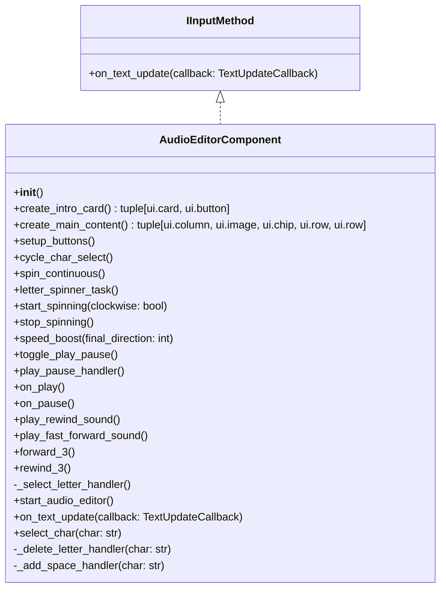
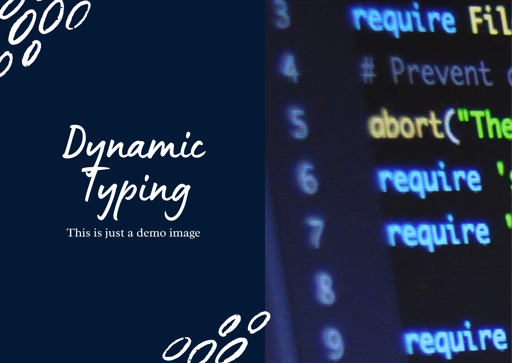
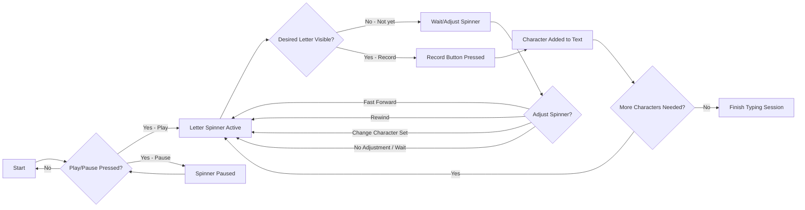

# __Audio Input Method__ 
---
## __Introduction__

This component is a playful, intentionally cumbersome typing test that fits into the larger "Wrong Tool for the Job" project.

It highlights the absurdity of using a vinyl record interface to type text. Users interact with the typing test by using the vinyl record controls — **play**, **pause**, **skip forward/backward**, and other buttons — to select characters.

When the user presses **play**, a song begins and characters are displayed in sequence as the music plays. Users watch the characters and, when they see the one they want, they press **record** to send it to the typing test component. Characters can be **lowercase letters**, **uppercase letters**, or **punctuation**, and the user can cycle through **three different tracks**, each corresponding to a type of character. This component turns a simple typing interaction into a quirky, musical, and humorously inefficient experience, while still connecting with the larger typing test system.

## __User Interface__
### Components
- Intro
- Buttons
- Record
- Letter chip
- Overall Pic

### Styling

- `color_style.ColorStyle` — defines a consistent theming system for the app. 
  
---
### Detailed Flow

- User clicks a button on the record → triggers a play, pause, or skip action.  
- Letter spinner updates asynchronously → new letter is displayed in the UI.  
- `select_char()` fires when the record button is pressed → sends the current string of typed characters to the Typing Test Component via `TextUpdateCallback`.  
- Typing Test Component updates the sentence display → shows which letters were typed correctly or incorrectly and tracks the user's position in the sentence.  
- WPM/WPH is calculated only after the user reaches the end of the sentence with correct typing.  
- UI updates → record animation and letter chip continue spinning, creating the “wrong tool for the job” experience.
---
## __Code__

<!-- ##### Core Libraries & Classes

This component uses a combination of a main framework, utility libraries, and interface classes. Below is a breakdown of the most important parts. -->

#####Main Framework

- <em>`NiceGUI` — provides web-based UI elements, layouts, and events, handling interactivity, buttons, audio controls, and visual updates for the spinning record and character spinner. NiceGUI components also allowed me to play music and sounds when needed.

#####Utility Library

- <em>`Asyncio` — used to create a timer so the vinyl record image can spin, the characters cycle through their sets, and buttons can be monitored for actions such as rewind, forward, pause, and play. Also used to play sounds when buttons are pressed.

#####Interface Classes

- <em>`input_method_proto.IInputMethod` — the interface that this component implements to connect with the typing test module.
- <em>`TextUpdateCallback` — a function passed from the typing test module that allows this component to send selected characters back to the tester.
     
        def on_text_update(self, callback: TextUpdateCallback) -> None:
            """Register a callback to be called whenever the text updates."""

            Args:
                callback (TextUpdateCallback): Function called with updated text.

            
            self._text_update_callback = callback

---

### AudioEditor Component

Main class for the “typing DJ” component that renders a spinning vinyl record and character spinner.  

It interfaces with the typing test via `TextUpdateCallback` and manages the current character set including uppercase, lowercase, and punctuation.  

The component handles audio playback for the main track, rewind, and fast-forward, while controlling spinning speed and direction with asyncio tasks.  

It updates UI elements in real time, uses `ColorStyle` for consistent styling, and implements the `on_text_update` callback to communicate selected characters to the typing test.

---

> Additional advice to aid users in achieving better outcomes.

##More In Depth

- `cycle_char_select()` — Cycles between uppercase, lowercase, and punctuation character sets.  
- `spin_continuous()` — Runs asynchronously to continuously rotate the vinyl record.  
- `letter_spinner_task()` — Updates the character label asynchronously, cycling through the selected set.  
- `start_spinning()` / `stop_spinning()` — Controls vinyl record rotation.  
- `speed_boost()` — Temporarily increases spin speed for animations like fast-forward or rewind.  
- `toggle_play_pause()` / `play_pause_handler()` — Handles play/pause logic for music and character spinner.  
- `_select_letter_handler()` — Handles letter selection and triggers the text callback.  
- `_delete_letter_handler()` — Deletes the last character in the user text.  
- `_add_space_handler()` — Adds a space to the user text.  
- `forward_3()` / `rewind_3()` — Skip multiple letters with accompanying sound effects and spin animations.  
- `setup_buttons()` — Creates NiceGUI buttons and binds them to event handlers.

### Theme - Wrong Tool For The Job

- The `AudioEditorComponent` gets the job done, but it's the wrong tool for the task.  
- Using record buttons for single-character selection is deliberately overkill.  
- Audio feedback and animations create a multi-tasking, interactive environment.  
- Despite this, the component is fully functional and integrates cleanly with the Typing Test Component via callbacks and modular imports.

<!--  -->

#Demo