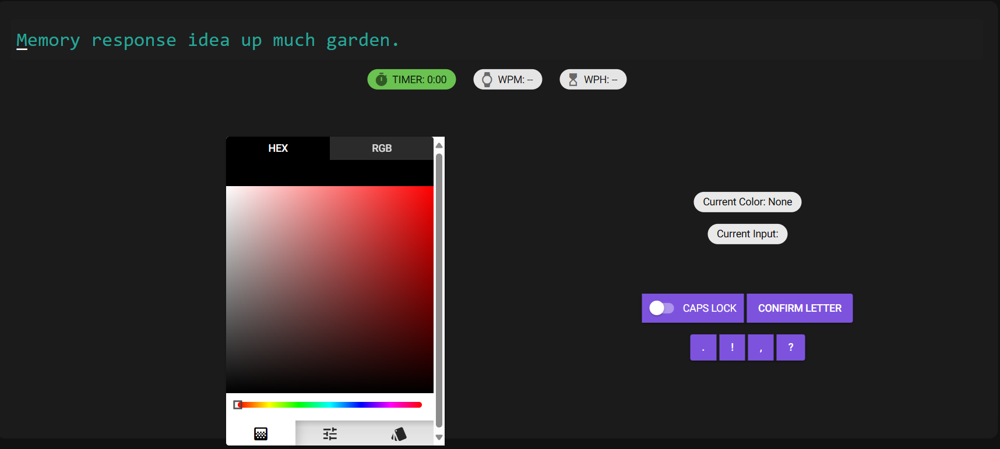
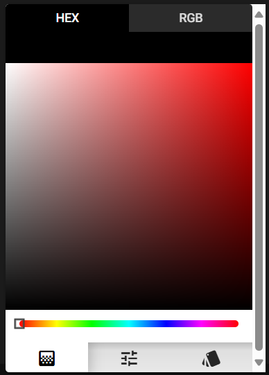
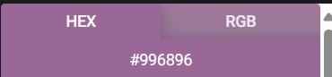
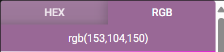
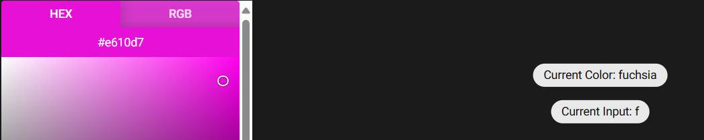
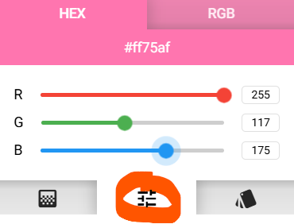
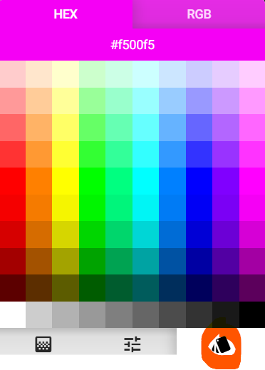
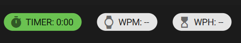
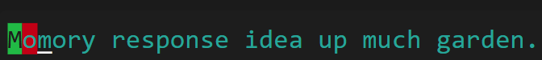

# Color Mixer Input Method

For full documentation visit [mkdocs.org](https://www.mkdocs.org).

## Intro

The `Color Picker` page offers the user a frustrating typing interface, possibly triggering bouts of synesthesia. Users
are tasked with typing a randomly generated phrase, but first they have to find the letters...

## User Demo

Below is a brief demo of how a user may interact with the page. 

# 

A few of the user inputs are described below:

1. User clicks the spectrum in a region corresponding to the color `lime` which outputs the letter `l`
2. User toggles the CAPS LOCK on. Note that this does not capitalize the L.
3. User confirms the letter L
4. Note that `l` is highlighted in red in the target text since it is the incorrect character
5. The user clicks black to input backspace and remove the character `l`
6. The user selects `lime` again which now inputs `L`.
7. The user confirms the input
8. The user changes the color hues using the spectrum meter
9. The user removes the `CAPS LOCK`, selects `orange`, then confirms the letter `o`

## Main UI

Users will see the page below:

### Typing with the Color Mixer 

# 

The color mixer is the main keyboard. Users can access all 26 letters, backspace, and space by clicking a color. Special
characters and capital letters are accessible via the buttons in the bottom right. The mixer panel displays color values
in hexadecimal or (Red,Green,Blue). See the image 
below.

# 
# 

> Colors correspond to intuitive letters where possible, but some letters are hard to find...

### More on Typing 

#### Letters

In order to type a **letter** the user

1. Clicks a color on the color palette
2. Clicks the **CONFIRM LETTER** button

> **Letters will not appear in the target output prior to confirmation!!!**

#### Special Characters

- To type the special characters `. ! , ?` press the corresponding button. 
- The `CAPS LOCK` switch controls letter case, which the user can toggle. It defaults to the off position (white) and 
turns on (blue) when clicked.

#### More Details

The first letter of the selected color determines the selected letter. **Black** and **white** correspond to **backspace** 
and **space** inputs, respectively. 

*Letters* must be confirmed using the **CONFIRM LETTER** button. Special characters, *backspace*,and *space* inputs will 
automatically display in the target output.

### Help Text

Upon clicking a color, the user sees *the name of the color selected and the corresponding letter* (see image below). 
This information is displayed on the right side of the color panel, above the special character buttons. This text is
meant to aid the user. Users must confirm letters before they are officially typed. Special characters are automatically 
confirmed and displayed, including space and backspace inputs. 

In the image below the user has clicked on the color *fuchsia* which corresponds to the letter f.

### More on the Color Mixer

The color mixer contains three modes. *Spectrum*, *Tune*, and *Palette*. The image above displays Spectrum mode, which 
is the default mode.

1. #### Spectrum

Users selects colors by clicking on the map. Users can adjust the spectrum meter to access various hues. Black and white 
are accessible on all levels. 

2. #### Tune

Users select colors by adjusting the intensities of Red, Green, and Blue. The values can be adjusted by dragging the bar
for a particular color, or by typing an integer (0 to 255 inclusive). The Tuner icon is circled in orange
below. Click the icon to switch to this view mode.

# 

3. #### Palette

Users select colors by clicking within the color palette. The Palette icon is circled in orange in the image below. 
Click it to switch to this view mode.

# 

> Note: Spectrum mode is recommended.

### Targets, statistics, and cues

The target sentence is displayed in green text. The top of the page also displays a timer and 
typing statistics. The timer begins when the first input is confirmed. Users receive visual clues indicating typing 
accuracy. Correct inputs are highlighted in green while incorrect inputs are highlighted in red. See the two images 
below.

# 
#   

## ImplementationHow it works

The color input page was created by implementing the class `ColorInputComponent`. 

The `niceGUI` framework was beneficial in implementing the page and class, especially in constructing the page layout.
The color mixer, CAPS LOCK, and special character elements were all created using functionality native to `niceGUI`. 
In particular, the color-mixer came from the `Quasar color-picker` component. Color-picker properties were tweaked to 
optimize the page, but many necessary feature were readily available. Further styling of page  elements was achieved 
using standard `CSS` and `Tailwind`.

The class consists of 13 methods used to construct the page, and another method `color_input_page` that was used for 
testing the class separately from the main program.

The class constructs the page layout, handles the user clicks, and establishes the backend logic necessary to map colors 
to text and to allow the class and page to interface with words per minute tester.

For each clickable page element the class contains a "handler" method that cleans up 
the backend after a user click. There are two methods for updating text that serve as helpers to the handler methods. There are two methods related to the ui that 1) set up the page layout and button positions 2) create the specific elements (e.g. color mixer, special character buttons)

The ui.page decorator corresponds to a method that was used for testing, but was not used to render the page that 
actually displays

The find closest member method is one of the major backend functions. Each of the 26 letters, backspace, and space map 
to a unique color. This information was stored using a dictionary with 28 items.

The RGB/hex code structure permits the user to select up to 16^6, or nearly 16.8 million colors. This method maps every 
possible hex code color to one of the 28 colors in the dictionary. Colors were mapped to their "closest" color in the dictionary using the their RGB coordinates and the Euclidean distance metric. The class contains two other static methods that serve as helper functions. One to convert hex code to rgb and another to compute the distance between two colors

For full documentation visit [mkdocs.org](https://www.mkdocs.org).

## Commands

* `mkdocs new [dir-name]` - Create a new project.
* `mkdocs serve` - Start the live-reloading docs server.
* `mkdocs build` - Build the documentation site.
* `mkdocs -h` - Print help message and exit.

## Project layout

    mkdocs.yml    # The configuration file.
    docs/
        index.md  # The documentation homepage.
        ...       # Other markdown pages, images and other files.
# Color Mixer

For full documentation visit [mkdocs.org](https://www.mkdocs.org).

## Commands

* `mkdocs new [dir-name]` - Create a new project.
* `mkdocs serve` - Start the live-reloading docs server.
* `mkdocs build` - Build the documentation site.
* `mkdocs -h` - Print help message and exit.

## Project layout

    mkdocs.yml    # The configuration file.
    docs/
        index.md  # The documentation homepage.
        ...       # Other markdown pages, images and other files.
