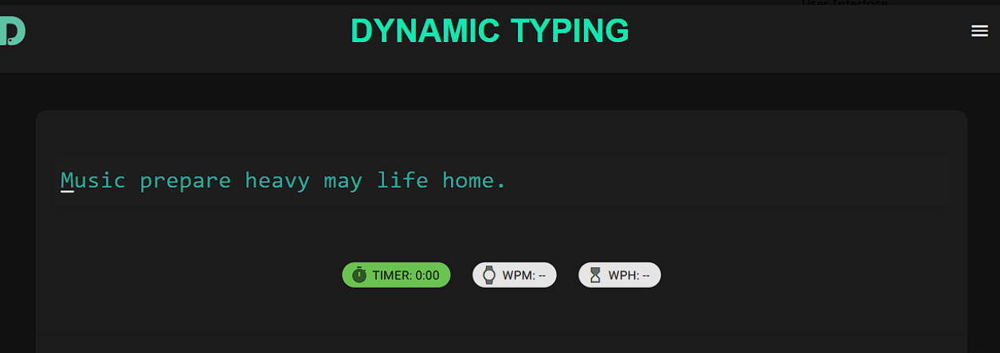
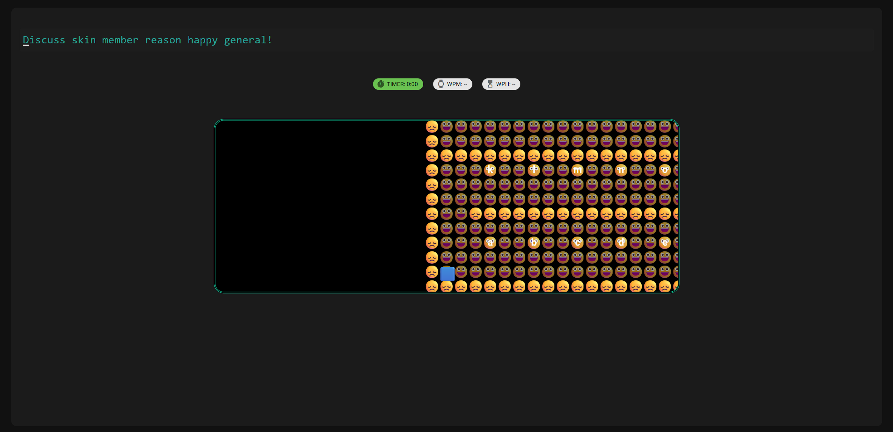
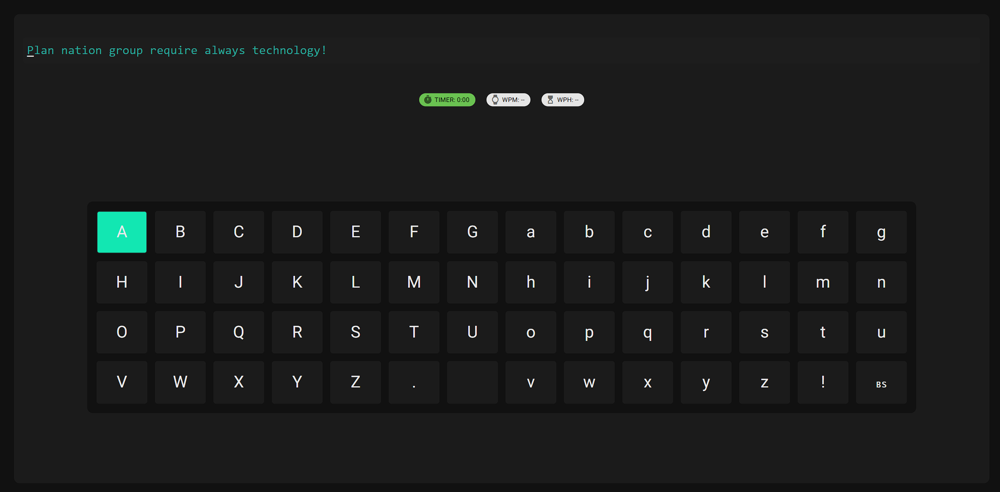
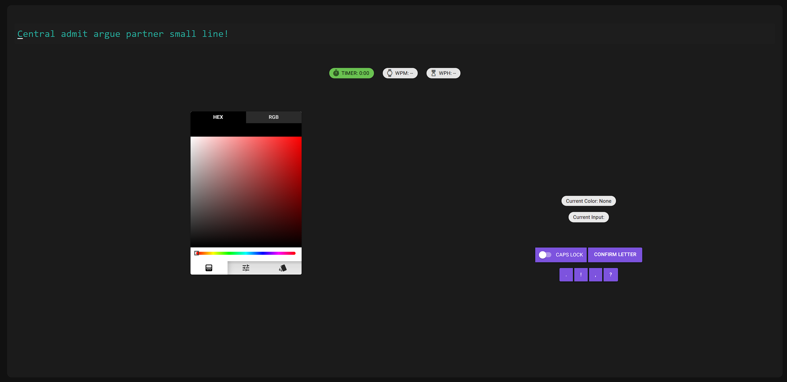
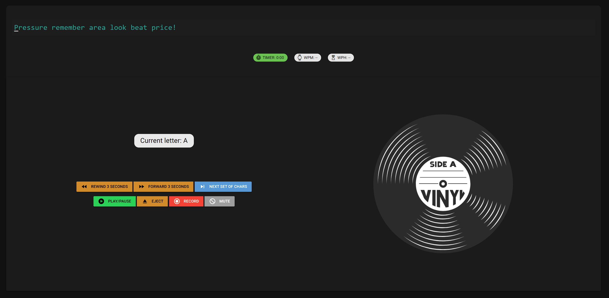

# Core
To bring everything together, we have multiple front-end components that allow each input method to work with the front end seamlessly.

### Input View
This component displays the text for the user to type and updates as the user inputs letters through the input method. It is initialised with the `full_text` argument, which is the text for the user to type. To interact with it, the input method will call the `set_text()` method with the output of the input method interaction, resulting in either a green or red box to appear over the letter, symbolising either the correct or incorrect letter being inputted.

{ style="max-width:80%;height:auto;"}

### Input Method
The four input methods are built as subclasses of the `IInputMethod` protocol within modules that can be imported into the testing page. The `IInputMethod` super class requires the subclasses to support a `on_text_update(callback)` function to react to the user typing in real time.

    from collections.abc import Callable
    from typing import Protocol

    type TextUpdateCallback = Callable[[str], None]

    class IInputMethod(Protocol):
        """An interface for any input method renderable in the WPM test page."""

        def on_text_update(self, callback: TextUpdateCallback) -> None:
            """Call `callback` every time the user input changes."""
            raise NotImplementedError

## WPM Testing Page
The Words Per Minute (WPM) testing page is initialized in `wpm_tester.py`. This creates a general user interface frame that the input view and the input method are injected into and displayed.

{ style="max-width:80%;height:auto;"}
{ style="max-width:80%;height:auto;"}
{ style="max-width:80%;height:auto;"}
{ style="max-width:80%;height:auto;"}

